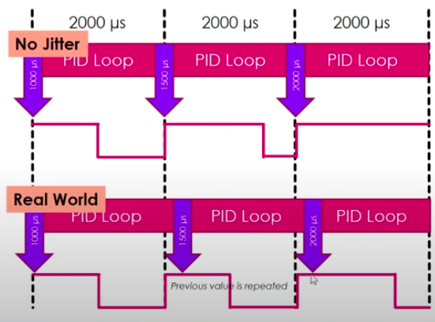

<h1 align="center">Week 01 Report</h1>

### *Intern: Do Thanh Trung*

### **1. Drone motor and ESC**  
**1.1. Select motor**  
Things to consider when choosing drone motors:  
1. Weight of your drone  
2. Efficiency  
3. Power  
4. Torque

Types of motors:
There are 2 types of motors used in drones: brushed and brushless motors.

| Type           | Definition  | Application | Lifespan | Energy saving |
| -----------    | ----------- | ----------- | -------- | ------------- |
| Brushed DC motor| Brushed DC motors possess a rotating armature that works like a electromagnet . A rotary switch is connected that helps to reverse current direction for every half cycle so that poles can be pushed or pulled against permanent magnets connected outside motor.       | Commonly used for drones. | It can serve users up to 1000 hours | Maintenance for carbon crushes to ensure proper energy consumption and satisfactory operation 
| Brushless DC motor | 	Brushless DC Motors do not possess brushes, they just have a permanent magnet and it switched with electronic polarity changes. Its movements can be controlled via a dedicated electronic controller and speed feedback mechanism.        | Commonly used for drones that demand higher rotation speeds to manage flights. | work effectively up to more than 1000 hours | Brusheless motors are highly energy efficient as compared to brushed ones.

>If the motor is expected to be used for very less time, it is recommended to connect brushed DC motor as it will provide sufficient output with cost effectiveness. But in case if you need motors continuously or when your device is going to work on higher power rating then brushless motor will be best idea for long hour flights.

- BLDC motor:  
A BLDC motor consist of two main parts, a stator and a rotor.  

 Brushless DC Motor Working Principle 

**1.2. Electronic Speed Controller(ESC):**  
An ESC controls the brushless motor movement or speed by activating the appropriate MOSFETs to create the rotating magnetic field so that the motor rotates.  
The battery supplies direct current, while the brushless motor accepts three-phase alternating current.

 

### **2. ESC Protocols:**  
      
ESC Protocols is the “language” that the flight controllers and ESC use to communicate, one of the most basic task is to tell how fast the motor should be spinning.
 The Oneshot, Multishot and Dshot are the ESC calibration protocols.This protocol allows connecting Electronic speed controllers (ESC) to flight controller.  
 **Analog PWM**  
0% duty cycle means STOP and 100% duty cycle means FULL POWER.

 **Standard PWM**  
If pulse length is 1ms then STOP and when pulse length is 2ms then FULL POWER.  
The maximum frequency: 500Hz.  
The signal delay is 2ms.

 <b>Problem with PWM </b>
 

- Unsynced output  
- Limited updated rate (frequency)  

 **Oneshot**  
- Oneshot125:  
Combination of SyncPWM and FastPWM
>>- SyncPWM: the exact moment the PID loop output a new value
>>- FastPWM: Standard PWM is speed up 8x, new pulse length is 125-250µs, refresh rate up to 4 kHz
- Oneshot42:  
Oneshot42 is 3 times faster than Oneshot125 with a maximum frequency of 12 kHz, signal delay of 42µs.

 **Multishot**  
This is the fastest ESC protocol among all the above with a maximum frequency of 32 kHz. It is 10 times faster than Oneshot125. This is not a widely supported protocol because of a limited number of Multishot ESCs..

 **Dshot (Digitalshot)**  
Standard PWM, Oneshot125, Oneshot42, and Multishot these are all analog signals. They all rely on the length of the electrical pulse to determine the value being sent.  

The Dshot is itself a digital signal so it’s exciting to know that ESC calibration will no longer be necessary. Because of the nature of the digital signal, which is one’s and zero’s, it will also be much more resistant to electrical noise.  

A DShot data packet consists of a total of 16 bits: 11 bits for throttle value (211 = 2048 steps), 1 bit for telemetry request and 4 bit for CRC checksum (cyclic redundancy check).

There are 4 different Dshot protocol types:
1. DShot1200 ESC - 1200Kbits/Sec.  
2. DShot600 ESC - 600Kbits/Sec.  
3. DShot300 ESC - 300Kbits/Sec.  
4. DShot150 ESC - 150Kbits/Sec.    

### **3. PID control**

