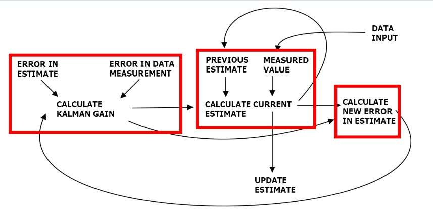

<h1 align="center">Week 03 Report</h1>

## *Intern: Do Thanh Trung*
**1. Sensors in drone**  
- **Gyroscope**: Gyro sensors, this sensor is used to provide angular motion to the drone. 3-axis gyroscope provides angular velocity in 3 axes.  

*Gyroscope* 

- **Accelerometer**: accelerometer provides linear acceleration in 3 axes.

*Accelerometer* 

- **Barometer**: Barometers are sensors that measure air pressure. In drones, this air pressure information is used to determine the drone’s altitude.
- **Rangefinder**: There are different types of rangefinders found in drones but all of them perform a simple task: to determine how far away from the ground the drone is
- **GPS and other satellite positioning systems**: This drone sensor type uses satellite launched around the Earth to determine specific geographic locations. GPS receiver module gives output in standard (National Marine Electronics Association) NMEA string format. This NMEA string output from GPS receiver contains different parameters separated by commas like longitude, latitude, altitude, time etc.
- **Magnetometer**: In cases where determining the drone’s heading using only GPS location is not appropriate, a drone needs to have a magnetometer. A magnetometer measures the strength and direction of a magnetic field. Using this principle, a drone can always determine the direction of the magnetic North and adjust its trajectory accordingly.
- **Distance Sensor**: These type of sensors are used to sense the obstacles. The distance sensors are based on ultrasonic, laser or LIDAR.
- **Optical Flow Sensor, Beacons, Wheel Encoders, Visual Odometry...**

> **Sensor Fusion Approach**

When used independently from each other, the raw readings from the accelerometer and gyro are not reliable. The gyro measures angular rotations and, unlike the accelerometer, is hardly affected by external forces. However, the gyro tends to drift from its mean value in the long run. Sensor fusion combines the sensor data from different sources to reduce their uncertainty and improve the overall quality of any individual series of readings.  
- Inertial navigation system (INS): includes gyro, magnetometer, accelerometer, and GPS. It will fuse all those sensors together to give a robust navigation output.  
- Inertial Measurement Unit (IMU): gyro, accelerometer, and magnetometer. IMU just outputs raw data without navigation.
- Attitude Heading Reference System (AHRS): An IMU + GPS. It doesn't include a Kalman filter, so AHRS would be a good fit for people that already have a custom filter or want more sensor data.

**2. Kalman filter**  

    Kalman filter is an algorithm that provides estimates of some unknown variables given the measurements observed over time. Kalman filters have been demonstrating its usefulness in various applications. Kalman filters have relatively simple form and require small computational power.

To be able to adjust, filter noise or track objects, Kalman filter consists of  important parts:

 - First : the measured value, there is always a noise so you can filter this out come up with the second element.
 - Second: variable Prediction  from previous times.

*Block diagram of Kalman filter*

Step 1 : The Kalman filter will update two key weights:
- Measured value: current information gathered over time.
- Previous estimate: information predicted from previous values.
Then calculate the Error Estimate.  

Step 2 : Calculate Kalman gain
The Kalman gain formula determines the trust between Error in data
measurement (error at current location) and Error in estimate (error of prediction).

**KALMAN GAIN INTUITION**  
 - HIGH KALMAN GAIN  
A low measurement uncertainty relative to the estimate uncertainty would result in a high Kalman Gain (close to 1). This means that the new estimate would be close to the measurement. 

*High KALMAN GAIN*

 - LOW KALMAN GAIN  
A high measurement uncertainty relative to the estimate uncertainty would result in a low Kalman Gain (close to 0). This means that the new estimate would be close to the previous estimate.

*Low KALMAN GAIN*

**3. Kalman filter in Ardupilot**  

Ardupilot uses digital signal processing filters in its INS:
Extended Kalman filter (EKF) and Discrete Cosine Matrix (DCM). DCM was the first method used by Ardupilot. 

The advantage of the EKF over the simpler complementary filter algorithms (i.e. “Inertial Nav”), is that by fusing all available measurements it is better able to reject measurements with significant errors. This makes the vehicle less susceptible to faults that affect a single sensor. Current stable versions of ArduPilot use EKF3 as their primary attitude and position estimation source with DCM running quietly in the background.  

**INNOVATION**  
The EKF constantly makes predictions of position/velocity/attitude based on past input and compares them to present measurements. Is the prediction is different than measured, an innovation occurs. If the difference is not too great, the measurement is used, on weighted basis. Large innovation for too long will cause the EKF to reject the sensor or declare that its "lost" 

Lane Switch and Fallback to DCM  
If the innovations are too great for too long, the EKF will switch to a redundant sensor, if available, or ultimately fall back to using DCM(Plane/Rover only) which allows "dead reckoning" even without a GPS.

The EKF provides greater accuracy and eliminates noise and the effect of turbulence on position and attitude estimates and it provides compensation for acceleration during turns to the AHRS to provide accurate attitude information. It will even "learn" compass offsets and IMU biases if slightly different than original calibration