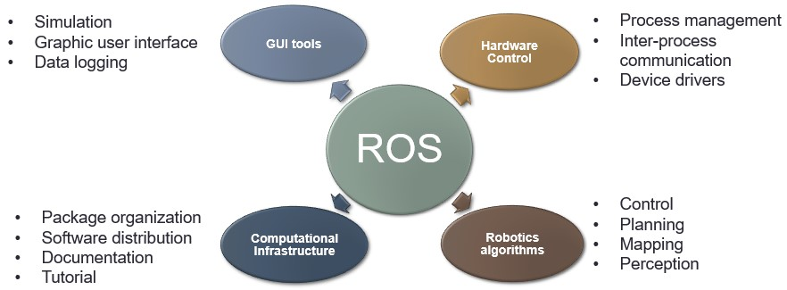
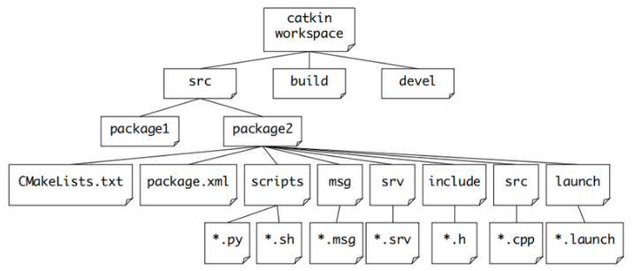
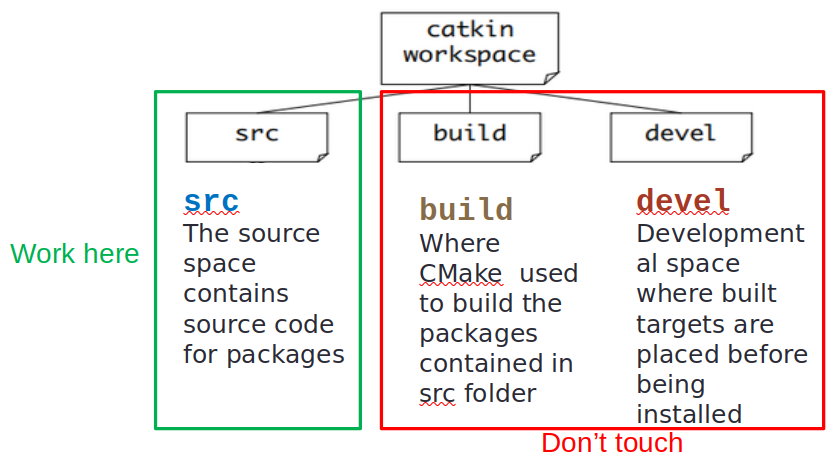
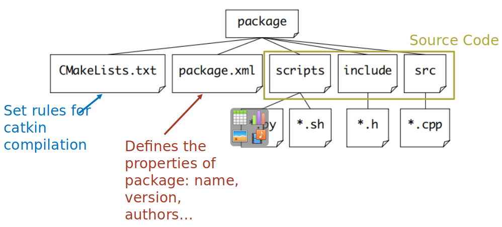
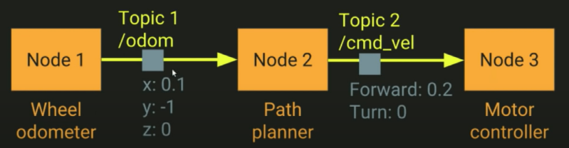

<h1 align="center">Week 05 Report</h1>

## *Intern: Do Thanh Trung*

## **Ardupilot simulation using Gazebo and ROS**
### Content: 
- Overview
- Gazebo, ROS Introduction 
- Demo

### **1. Overview**  

- Simulation allows for the safe testing of experimental code and settings. Crashing virtual vehicles is a lot cheaper than crashing real ones!
- Simulation is implemented by using a Flight Dynamics Model (FDM) of the vehicle to simulate the physics involved with vehicle movement. It receives inputs from a SITL (Software in the Loop) program running the ArduPilot firmware (which are the firmware’s servo/motor outputs) and outputs vehicle status,position, velocities, etc. that result from those inputs back to the firmware simulation. Just as sensors would in the real world case.

    

*Overview System*

- Gazebo is a 3D robotics simulator used to create models and simulation environments. 
-  ROS is an open-source robotics middleware suite. It provides services designed for a heterogeneous computer cluster such as hardware abstraction, low-level device control, implementation of commonly used functionality, message-passing between processes, and package management.

    

*Architecture System of Simulation*

### **2. Introduction** 
> ## [Ardupilot](https://ardupilot.org/)
- ArduPilot is a trusted, versatile, and open source autopilot system supporting many vehicle types: multi-copters, traditional helicopters, fixed wing aircraft, boats, submarines, rovers and more.
- The ArduPilot software suite consists of navigation software (typically referred to as firmware when it is compiled to binary form for microcontroller hardware targets) running on the vehicle (either Copter, Plane, Rover, AntennaTracker, or Sub), along with ground station controlling software including Mission Planner, APM Planner, QGroundControl, MavProxy, Tower and others. 

    

*Ardupilot Ecosystem*

> ## [Gazebo](https://gazebosim.org/)

Gazebo is a 3D dynamic simulator with the ability to accurately and efficiently simulate populations of robots in complex indoor and outdoor environments. While similar to game engines, Gazebo offers physics simulation at a much higher degree of fidelity, a suite of sensors, and interfaces for both users and programs.

    

*Gazebo GUI*

**Typical uses of Gazebo include:**
- testing robotics algorithms,

- designing robots,

- performing regression testing with realistic scenarios

**A few key features of Gazebo include:**

- multiple physics engines,

- a rich library of robot models and environments,

- a wide variety of sensors,

- convenient programmatic and graphical interfaces

> ## Robot Operating System
>> **Intro**
- ROS is an open source framework for robot control
- ROS serve as a common software platform for people who are building and using robot
    - Share code and ideas 
    - Contain >2000 software package  

    

*ROS*

>> **Why should you use ROS for robotics ?**
- ROS is general
- ROS has great simulation tools
- ROS is light
- Control multiple robots with ROS
- ROS is an open source project with a permissive license

>> ROS philosophy
- **Peer-to-peer**: individual packages communicate over defined API
- **Network**: Multiple computer can run and communicate over the network
- **Multi-Language**: ROS module can be written and multiple languages (C++, Python, Matlab, Java…)
- **Thin**: stand-alone libraries are build inside ROS layer
- **Free and open source**

>> ROS Build System
- A build system is responsible for generating 'targets' from raw source code that can be used by an end user.
- ROS is a very large collection of loosely federated packages. That means lots of independent packages which depend on each other, utilize various programming languages, tools, and code organization conventions.  
- [catkin](http://wiki.ros.org/catkin) specifically tries to improve development on large sets of related packages in a consistent and conventional way. 

    

*ROS Build System*

>> ROS Workspace
- A workspace is a set of directories (or folders) where you store related pieces of ROS code.

    

*ROS Workspace*

>> ROS Package
- When we execute the catkin_make instruction, the compilation system will look for the package executable package one by one.

    

*ROS Package Structure*

>> How ROS Works
- ROS ideas: a robotic task can be decomposed into many independent subsystems (**Node**)
- Nodes (code or tools) communicate with each other using messages (**Topics**)
- Each node can send or get data using publish/subscribe model

    

*ROS Work*

### **3. Demo**   
- [Using YOLO algorithm to detect object - Drone Gazebo Simulation](https://youtu.be/x5svMPJEZEA)
- [Obstacles avoidance using Lidar ](https://youtu.be/f5gf13DRQ5o)
- [Basic Drone Swarm](https://youtu.be/P61jZpc_cTM)