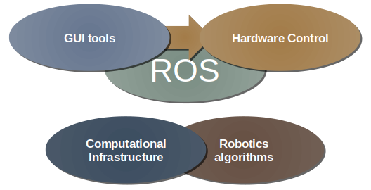

<h1 align="center">Week 05 Report</h1>

## *Intern: Do Thanh Trung*

## **Ardupilot simulation using Gazebo and ROS**
### Content: 
- Overview
- Gazebo, ROS Introduction 
- Demo

### **1. Overview**  
- The ArduPilot software suite consists of navigation software (typically referred to as firmware when it is compiled to binary form for microcontroller hardware targets) running on the vehicle (either Copter, Plane, Rover, AntennaTracker, or Sub), along with ground station controlling software including Mission Planner, APM Planner, QGroundControl, MavProxy, Tower and others. 
- 

    

*Architecture System of Simulation*

### **2. Introduction** 
> ## [Ardupilot](https://ardupilot.org/)
ArduPilot is a trusted, versatile, and open source autopilot system supporting many vehicle types: multi-copters, traditional helicopters, fixed wing aircraft, boats, submarines, rovers and more.

    

*Ardupilot Ecosystem*

> ## [Gazebo](https://gazebosim.org/)

Gazebo is a 3D dynamic simulator with the ability to accurately and efficiently simulate populations of robots in complex indoor and outdoor environments. While similar to game engines, Gazebo offers physics simulation at a much higher degree of fidelity, a suite of sensors, and interfaces for both users and programs.

    

*Gazebo GUI*

**Typical uses of Gazebo include:**
- testing robotics algorithms,

- designing robots,

- performing regression testing with realistic scenarios

**A few key features of Gazebo include:**

- multiple physics engines,

- a rich library of robot models and environments,

- a wide variety of sensors,

- convenient programmatic and graphical interfaces

> ## Robot Operating System
>> **Intro**
- ROS is an open source framework for robot control
- ROS serve as a common software platform for people who are building and using robot
    - Share code and ideas 
    - Contain >2000 software package  

    

*ROS*

>> **Why should you use ROS for robotics ?**

### **3. Demo**   
- [Using YOLO algorithm to detect object - Drone Gazebo Simulation]()
- [Obstacles avoidance using Lidar ]()
- [Basic Drone Swarm]()