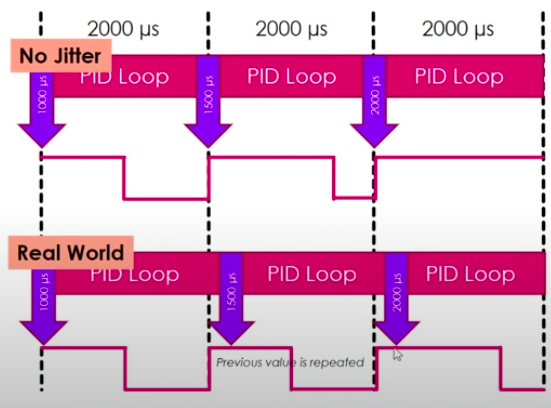

<h1 align="center">Báo cáo tuần 1</h1>

### *Đỗ Thành Trung*

1. Tìm hiểu về động cơ và ESC
    - Chọn động cơ:

    Việc lựa chọn động cơ cho một hệ thống máy bay không người lái sẽ phụ thuộc vào nhiều yếu tố, đặc biệt là trọng lượng của UAV. Một động cơ cần phải có khả năng tạo ra đủ lực đẩy để chống lại trọng lượng của máy bay không người lái và giúp nó có thể cất cánh.

    Có 2 loại động cơ được sử dụng trong máy bay không người lái: động cơ có chổi than và động cơ không chổi than

    
    Động cơ không chổi than mạnh hơn động cơ có chổi than và chúng có thể chạy lâu hơn. Quadcopter thường sử dụng động cơ một chiều không chổi than (BLDC)  do hiệu suất cao và khối lượng nhỏ. Động cơ bay không chổi than yêu cầu bộ điều khiển tốc độ điện tử (ESC) để hoạt động.

    >>BLDC motor:  
    - Stator: bao gồm lõi sắt (các lá thép kĩ thuật điện ghép cách điện với nhau) và dây quấn. Cách quấn dây của BLDC khác so với cách quấn dây động cơ xoay chiều 3 pha thông thường, sự khác biệt này tạo nên sức phản điện động dạng hình thang mà ta thấy. Nếu không quan tâm tới vấn đề thiết kế, chế tạo động cơ, ta có thể bỏ qua sự phức tạp này.
    
    - Rotor: trục động cơ và nam châm vĩnh cửu

    >>Cảm biến Hall  
        BLDC motor sử dụng cảm biến vị trí Hall. Cảm biến Hall được gắn trên stato của BLDC để phát hiện các nam châm vĩnh cữu trên rotor khi quét qua nó
    
    >>ESC:

    Bộ điều khiển tốc độ(ESC) có nhiệm vụ là truyền năng lượng từ pin đến động cơ không chổi than. Nhu cầu sử dụng chúng nảy sinh do một số tính năng của động cơ BLDC. Tóm lại, pin cung cấp dòng điện một chiều, trong khi động cơ không chổi than chấp nhận dòng điện xoay chiều ba pha.
    

2. Tìm hiểu về PWM, Oneshot, Multishot, Dshot
        
    Giao thức hiệu chuẩn ESC là “ngôn ngữ” mà bộ điều khiển chuyến bay và ESC sử dụng để giao tiếp, một trong những nhiệm vụ cơ bản nhất là cho biết động cơ quay nhanh như thế nào. 
     Oneshot, Multishot và Dshot là các giao thức hiệu chuẩn ESC. Giao thức này cho phép kết nối Bộ điều khiển tốc độ điện tử (ESC) với bộ điều khiển bay.  
     **Analog PWM**  
    0% duty cycle thì STOP and 100% duty cycle thì FULL POWER.

     **Standard PWM**  
    Nếu độ dài xung là 1ms thì STOP và khi độ dài xung là 2ms thì FULL POWER. Do đó tần số tối đa là 500Hz

    
     **Oneshot**
    - Oneshot125:  
    Kết hợp của SyncPWM và FastPWM
    >>- SyncPWM: thời điểm chính xác khi PID loop xuất ra output và không bị "trôi" tín hiệu.  
    >>- FastPWM: Standard PWM được tăng tốc lên 8 lần, nghĩa là độ dài xung mới là 125-250µs, tần số tối đa là 4 kHz
    - Oneshot42:  
    Nhanh hơn 3 lần so với Oneshot125 với tần số tối đa là 12 kHz và độ trễ tín hiệu là 42µs.

     **Multishot**  
    Đây là giao thức ESC nhanh nhất trong số tất cả các giao thức trên với tần số tối đa là 32 kHz. Nó nhanh hơn 10 lần so với Oneshot125. Đây không phải là một giao thức được hỗ trợ rộng rãi vì một số ESC Multishot có hạn.

     **Dshot**  
    Standard PWM, Oneshot125, Oneshot42 và Multishot, tất cả đều là tín hiệu analog. Tất cả đều dựa vào độ dài của xung điện để xác định giá trị được gửi đi.

    Dshot là một tín hiệu digital nên việc hiệu chuẩn ESC sẽ không còn cần thiết nữa. Do bản chất của tín hiệu kỹ thuật số là tín hiệu số một và số không, nên tín hiệu này cũng sẽ có khả năng chống nhiễu điện cao hơn nhiều.

    Các loại giao thức Dshot:
    1. DShot1200 ESC - 1200Kbits/Sec.  
    2. DShot600 ESC – 600Kbits/Sec.  
    3. DShot300 ESC – 300Kbits/Sec.  
    4. DShot150 ESC – 150Kbits/Sec.    

    
3. PID control

